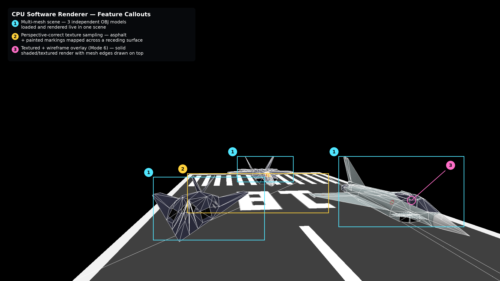

# Real Time Software Based 3D Graphics Engine

A fixed-function 3D graphics engine built from scratch in C, driven by a specific question: **how does classical 3D graphics mathematics actually execute on a CPU?**


Every stage of the rendering pipeline is implemented by hand — no graphics API, no hardware acceleration. The CPU does all of it: transformation, clipping, rasterization, depth testing, and texture sampling. The project was built three weeks after deciding to stop being fascinated by the problem from a distance and actually solve it.

---

## Demo

<div style="display: flex; flex-wrap: wrap; justify-content: center; gap: 10px;">
  
  
  
  
  
  
</div>

---

## What Was Built

A complete CPU-based rendering pipeline capable of loading and rendering multiple textured OBJ meshes in a live interactive scene, with switchable rendering modes and real-time camera movement.

| Module | Responsibility |
|---|---|
| `matrix.c` | 4×4 matrix construction and multiplication; perspective projection; look-at view matrix |
| `triangle.c` | Scanline rasterization; barycentric coordinate interpolation; perspective-correct texture sampling; Z-buffer depth testing |
| `clipping.c` | Sutherland-Hodgman polygon clipping against six view frustum planes in camera space |
| `camera.c` | First-person camera with pitch/yaw rotation and delta-time movement |
| `mesh.c` | OBJ file parsing; multi-mesh scene management |
| `light.c` | Directional lighting via surface normal and light direction dot product |
| `display.c` | SDL2 framebuffer management; pixel and primitive drawing |

---

## The Intellectual Arc

The central question this project answers is not "how do I use a graphics API" but "what is a graphics API actually doing." Every matrix multiply, every barycentric weight, every perspective divide happens explicitly in C. The mathematics is not hidden behind a driver — it is the code.

What became clear building each stage is that 3D graphics is fundamentally a problem of coordinate system transitions. A vertex begins in model space, moves into world space via the world matrix, into camera space via the view matrix, gets clipped against the frustum, projected into NDC space via the perspective matrix, and finally mapped to screen pixels. Each transformation has a precise mathematical justification, and getting any one of them wrong produces immediately visible, often spectacular, failure.

This is not something you understand by reading about it. It becomes visible when you implement it.

---

## Rendering Pipeline

```
OBJ file → vertex data
    |
    ↓
World transform       ← scale, rotation, translation matrices composed
    |
    ↓
Camera transform      ← look-at view matrix; world → camera space
    |
    ↓
Backface culling      ← dot product of face normal and camera ray;
    |                    discard faces pointing away from the camera
    ↓
Frustum clipping      ← Sutherland-Hodgman against 6 planes in camera space;
    |                    polygon → retriangulated output triangles
    ↓
Perspective projection ← perspective matrix; perspective divide by w;
    |                     NDC → screen space
    ↓
Rasterization         ← scanline traversal; barycentric weights per pixel
    |
    ↓
Depth test            ← Z-buffer comparison per pixel
    |
    ↓
Texture sampling      ← perspective-correct UV interpolation
    |
    ↓
Framebuffer           ← SDL2 render to screen
```

---

## Key Technical Decisions

### Depth Sorting: From Painter's Algorithm to Z-Buffering

The first working version of the renderer used the painter's algorithm for depth ordering — sorting triangles back-to-front by their average Z depth before drawing them. It works, up to a point. The failure cases reveal themselves quickly: triangles that overlap in depth cannot be correctly ordered relative to each other regardless of sort order, and large scenes with many triangles make the per-frame sort cost visible.

The pivot to Z-buffering resolved both problems. Rather than sorting triangles, a depth buffer — a flat array of floats matching the framebuffer dimensions — stores the depth value of the closest fragment written to each pixel. Before writing a pixel, the incoming depth is compared against the stored value; it only writes if it is closer. The tradeoff is explicit: O(1) per-pixel depth resolution at the cost of a full-resolution float array in memory. For a renderer where per-pixel correctness is non-negotiable and triangle counts are high, that is the right tradeoff.

The depth value stored is `1/w` rather than raw Z — a consequence of the perspective projection. After the perspective divide, linear interpolation of Z across a triangle in screen space is not geometrically correct; interpolating `1/w` is. This is the same insight that drives perspective-correct texture mapping.

### Memory Layout and Cache Behaviour

Both the framebuffer and the Z-buffer are flat 1D arrays indexed as `y * width + x`. This is not incidental — it is the layout that matches the rasterizer's access pattern and the way CPUs load memory.

CPUs do not read from RAM one byte at a time. They load memory in 64-byte chunks called cache lines. When a pixel is written, the CPU loads that pixel and the 15 adjacent pixels into cache simultaneously. The next iteration of the inner rasterization loop writes the next pixel — already in cache. The iteration after that — still in cache. Sixteen pixel writes for the cost of one memory transaction. This is spatial locality: because the data is contiguous and the access is sequential, most writes hit data that is already in cache rather than going back to main memory.

The hardware prefetcher compounds this further. Modern CPUs watch memory access patterns and speculatively load data into cache before it is requested. The inner rasterization loop — `for (int x = x_start; x < x_end; x++)` — accesses memory with a perfectly sequential, fixed stride. The prefetcher recognises this pattern immediately and stays ahead of the loop, hiding memory latency almost entirely.

This is also why the rasterizer decomposes triangles into horizontal scanlines rather than traversing vertically. Screen pixels are stored row-major — rows are contiguous in memory. A vertical inner loop would access memory with a stride of `width * 4` bytes between each write, blowing through cache lines without reusing them. Scanline rasterization is not just a mathematical convenience; it is the traversal order that aligns with the memory layout. The algorithm and the data structure are designed for each other.

The Z-buffer is indexed identically to the framebuffer, so the depth read and write that accompany every pixel write are sequential and prefetchable by the same mechanism. The two hottest arrays in the renderer — written to millions of times per frame — are both operating almost entirely out of cache.

### Perspective-Correct Texture Mapping

Naive texture mapping interpolates UV coordinates linearly across a triangle in screen space. This produces the characteristic warping visible on textured surfaces in motion — a well-known artifact of early PlayStation graphics, where the hardware performed affine texture mapping for cost reasons. The distortion is most visible on large triangles viewed at oblique angles.

The correct approach interpolates `u/w` and `v/w` — the UV coordinates divided by the clip-space w value at each vertex — and then recovers the true UV at each pixel by dividing by the interpolated `1/w`. This works because quantities that vary linearly in 3D space vary as rational functions in screen space after perspective projection, and dividing by the interpolated `1/w` exactly inverts the projection distortion.

Implemented in `draw_texel`: barycentric weights are computed for the current pixel, `u/w`, `v/w`, and `1/w` are interpolated using those weights, and the recovered UV coordinates are used to index into the texture.

### Backface Culling

For any closed mesh, approximately half of all triangles face away from the camera at any given moment and will be completely occluded by front-facing geometry. Computing, clipping, projecting, and rasterizing them is pure waste.

Backface culling eliminates them early: the face normal is computed in camera space via the cross product of two triangle edges, and the dot product of that normal with the camera ray determines orientation. A negative dot product means the face is pointing away; it is discarded before any further pipeline work. For a multi-mesh scene this is a meaningful reduction in per-frame computation.

### View Frustum Clipping

Triangles that straddle the boundary of the view frustum — partially inside, partially outside — cannot simply be discarded or projected as-is. Discarding them leaves visible gaps at screen edges; projecting them produces undefined behaviour when vertices are behind the near plane, where the perspective divide produces inverted coordinates.

Sutherland-Hodgman clipping runs in camera space, before projection, against all six frustum planes. A triangle entering the clipper may exit as a polygon with up to nine vertices; that polygon is then retriangulated into a fan of triangles before projection proceeds. Clipping in camera space rather than NDC space means the near-plane singularity is avoided entirely — vertices are only projected after they are guaranteed to be inside the frustum.

### The Look-At View Matrix

The view matrix transforms world-space coordinates into camera-relative coordinates, making the camera the origin of the scene for all subsequent calculations. It is constructed by computing three orthonormal basis vectors — forward (camera-to-target), right (cross product of world up and forward), and corrected up (cross product of forward and right) — and assembling them into a matrix whose translation components are the negative dot products of each basis axis with the camera position. The result encodes both the camera's orientation and its position in a single matrix multiplication applied to every vertex in the scene.

---

## Mathematics at the Core

Every rendering operation reduces to a small set of linear algebra primitives:

- **Matrix-vector multiplication** — applies every spatial transformation: scale, rotation, translation, projection
- **Cross product** — computes surface normals for lighting and culling; constructs the orthonormal camera basis in the look-at matrix
- **Dot product** — measures alignment between vectors; drives both backface culling (face normal vs camera ray) and directional lighting (face normal vs light direction)
- **Barycentric coordinates** — express any point inside a triangle as a weighted sum of its vertices; the weights drive correct per-pixel interpolation of any vertex attribute (UV coordinates, depth, color)
- **Perspective divide** — the w-division that maps clip space to NDC; the source of all perspective-correctness requirements downstream

---

## Installation

**Dependencies**: GCC, Make, SDL2

On Ubuntu/Debian:
```bash
sudo apt install gcc make libsdl2-dev
```

On macOS (Homebrew):
```bash
brew install gcc make sdl2
```

**Build and run**:
```bash
git clone https://github.com/hyperactive-panda111/3d-software-renderer.git
cd 3d-software-renderer
make
make run
```

---

## Camera Controls

| Input | Action |
|---|---|
| `W` / `S` | Pitch camera up / down |
| `←` / `→` | Yaw camera left / right |
| `↑` / `↓` | Move forward / backward |
| `1` | Wireframe with vertex points |
| `2` | Wireframe only |
| `3` | Solid fill |
| `4` | Solid fill with wireframe overlay |
| `5` | Textured |
| `6` | Textured with wireframe overlay |
| `C` | Enable backface culling |
| `X` | Disable culling |
| `ESC` | Exit |

---

## References

- Scratchapixel — *The Perspective Projection Matrix* and *Rasterization: a Practical Implementation*
